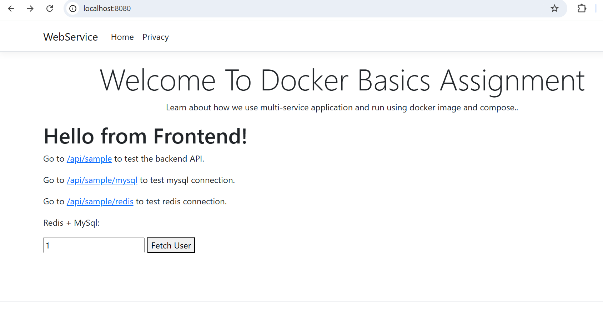
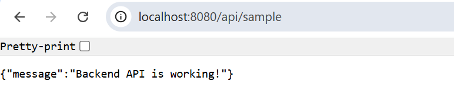
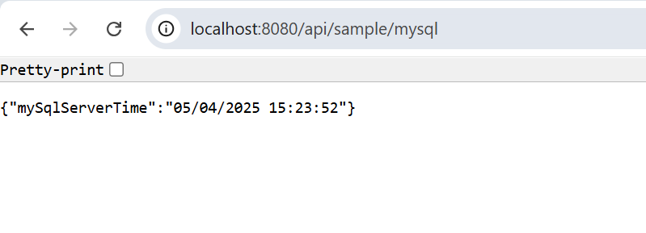
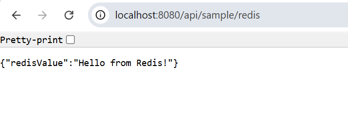
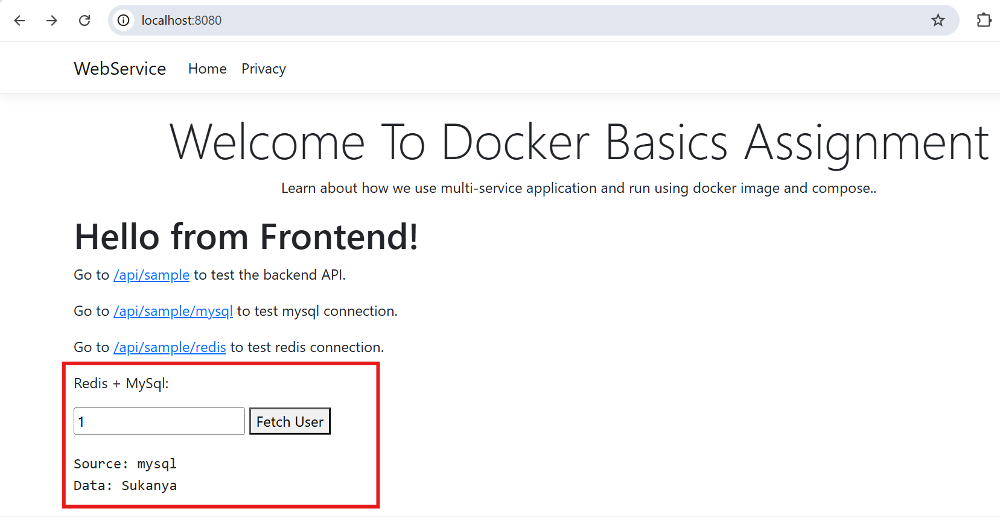
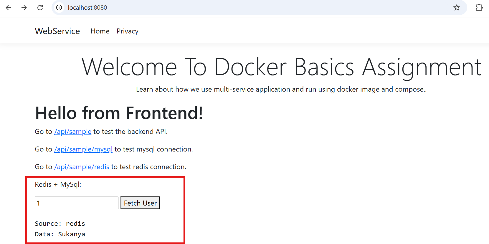

# Docker Basic and Advance Assignment

# Docker Basics Assignment

This is a multi-service application using:

- **.NET 8 Web API + Razor Pages (Frontend + Backend in one)**
- **MySQL Database**
- **Redis Cache**

It’s dockerized using Docker Compose.

---

## 📦 Project Structure
/WebService → .NET Core Web API frontend + backend
/docker-compose.yml → Docker Compose configuration
/Dockerfile → WebService Dockerfile
/mysql-init/init.sql → MySQL initialization script

---

## 🚀 Features

- Test backend API: `/api/sample`
- Test MySQL connection: `/api/sample/mysql`
- Test Redis connection: `/api/sample/redis`
- Fetch user from MySQL + Redis: form on homepage

---

## 📸 Screenshots
/home/sukanya04/multi-service-app/App-Screenshots

---

## Links
- GitHub Repo: https://github.com/sukanya04-git/docker-multiservice-app
- Docker Hub Image: https://hub.docker.com/repository/docker/sukanya04/webservice/general 

---

## 💻 Prerequisites

- [.NET 8 SDK](https://dotnet.microsoft.com/en-us/download)
- [Docker Desktop](https://www.docker.com/products/docker-desktop/)
- [Git](https://git-scm.com/)

---

## ⚙️ Setup Instructions

### Clone the repository

git clone https://github.com/sukanya04-git/docker-multiservice-app.git
cd docker-multiservice-app

### Run without Docker
Make sure Redis and MySQL are running locally before you run the app.[refer appsettings.Development.json for connection strings]

You can start Redis with Docker (if you don't have a local install):
docker run -d --name local-redis -p 6379:6379 redis

And MySQL with Docker:
docker run -d --name local-mysql -p 3306:3306 -e MYSQL_ROOT_PASSWORD=passw0rd -e MYSQL_DATABASE=testdb mysql:8

Run the .NET WebService:
dotnet build
dotnet run --project WebService/WebService.csproj
Visit http://localhost:5292

### Run with Docker Compose
docker-compose up --build
Visit http://localhost:8080

### Useful Endpoints
/api/sample → backend check
/api/sample/mysql → MySQL check
/api/sample/redis → Redis check
/api/sample/user/{id} → MySQL + Redis combined

# Docker Advance Assignment 

## Optimization 
1. Multi-stage Dockerfile
2. versioning 

## Security Hardening 
1. **Non-Root Docker User**: App runs as a system user inside the container.
2. **.dockerignore**: Sensitive files are excluded from Docker context.
3. **Environment Variables**: Secrets are moved to `.env` file (should not be pushed to GitHub).
4. **Read-only Filesystem**: The container’s root is read-only.
5. **Dropped Linux Capabilities**: The container has minimal Linux privileges.

### 🚀 CI/CD Pipeline
- GitHub Actions used for building and pushing Docker images on branch push.
- Secrets stored in GitHub Actions.
- Image Tag: `sukanya04/webservice:advanced`

### 🔗 Links
- [GitHub Branch (Advanced)](https://github.com/sukanya04-git/docker-multiservice-app/tree/advanced-docker-assignment)
- [Docker Hub Image (Advanced)](https://hub.docker.com/repository/docker/sukanya04/webservice/tags)
